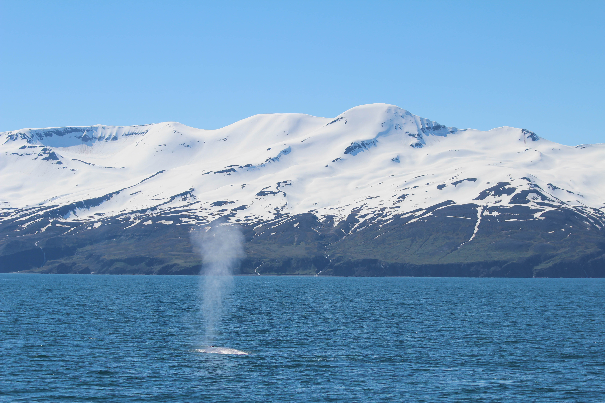

# Marine mammal observation logging and GPS tracking with python

This python code to generates a PyQt5 GUI for marine mammal observation logging and GPS tracking. It was developed for visual surveys of marine mammal abundance using a windows touchscreen PC or tablet. But it can also be used with out a touchpad. Wntries can be corrcetd or removed during the logging.

The GPS data is accesed as NMEA stream from a serial COM port. I am using this (15 Euro) USB GPS unit:

https://no.rs-online.com/web/p/gnss-gps-modules/2473251

https://wiki.dfrobot.com/USB_GPS_Receiver_SKU_TEL0137

Observation and GPS track tables are stored as csv tables. 

Happy sightings!

