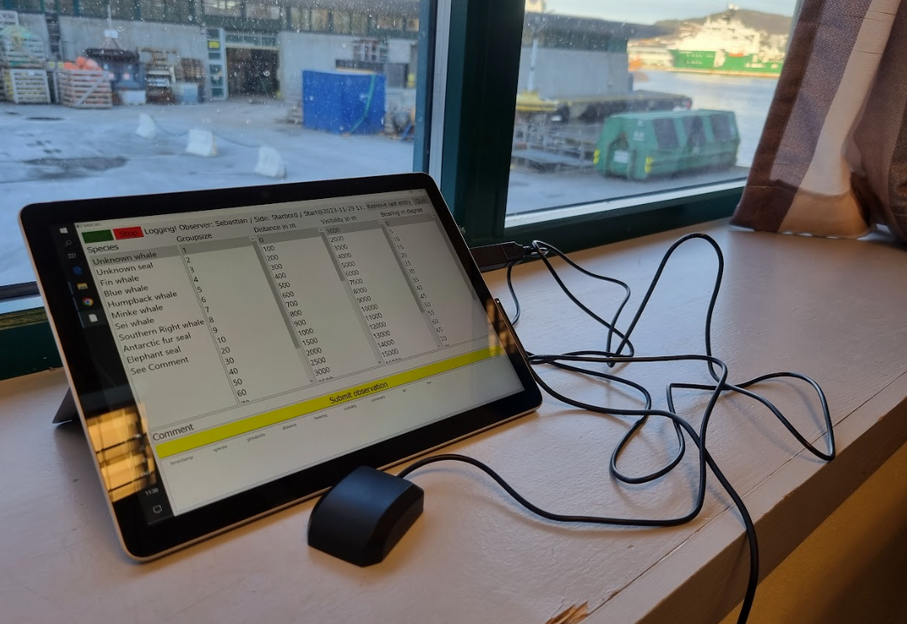
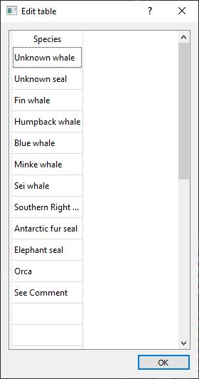
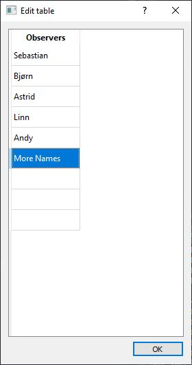
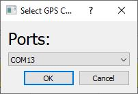
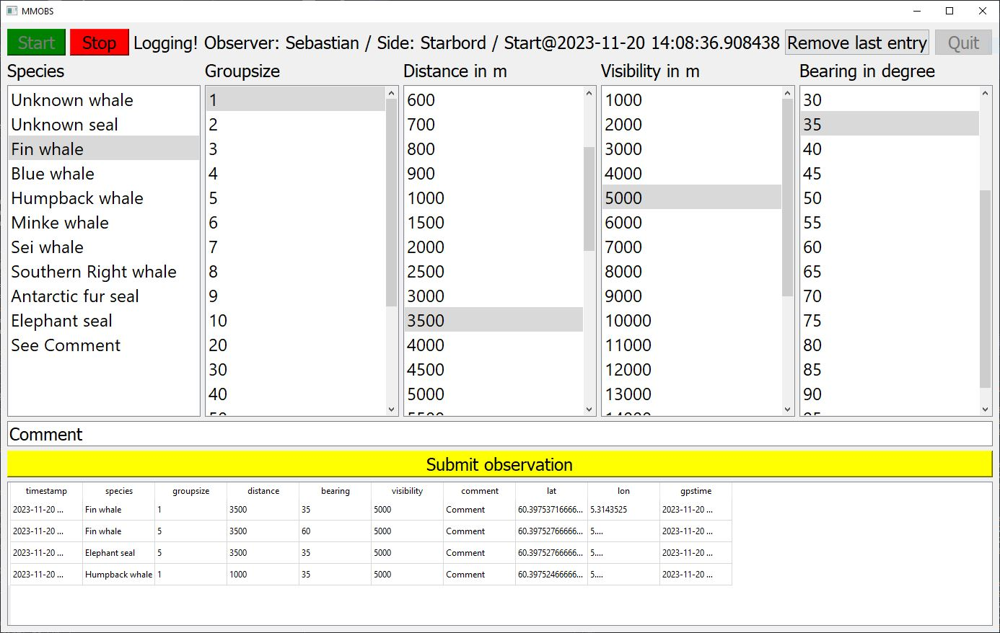

# Marine mammal observation logging and GPS tracking with python

This python script generates a PyQt5 user interface for marine mammal observation logging and GPS tracking. It was developed for visual surveys of marine mammal abundance using a windows touchscreen PC or tablet. But it can also be used without a touchpad. Entries can be corrected or removed during the logging. You can download it as compiled windows exe in the relases on the right side of this website.  



The GPS data is accessed as NMEA stream from a serial COM port. I am using this (15 Euro) USB GPS unit:

https://no.rs-online.com/web/p/gnss-gps-modules/2473251

https://wiki.dfrobot.com/USB_GPS_Receiver_SKU_TEL0137

Observation and GPS track tables are stored as csv tables. 

Happy sightings!

## Instructions

### Start-up

Connect the external GPS unit to your computer or tablet.

Start the program by running mmobs_logger.exe or the mmobs_logger.py script (if you have python installed). If python packages are missing install the using pip. 

At first the program will ask you for a list of species you expect to observe. By clicking onto fields in the table you can change the text. This list will only be editable here, restart the program if you want to add more species or write the species name in the comment line. 



Press Ok and then edit the list of observers by clicking into the table fields, again this list will only be editable here, restart the program if you want to add more observers. 



Press Ok, now the program will scan all available serial ports and list them in a dropdown menu. Choose the serial port that the GPS unit is attached to and press OK.



Now this user interface becomes available, make it fullsize for faster access to the right lists and buttons:



### Start an observation period

Press the Start button and select the observer, observed quadrant, visibility status and wave height. The program will start logging the GPS position every 5 seconds. To add sightings select the correct group size, species, distance and bearing from the lists by clicking onto the desired columns. The currently marked columns is highlighted in gray . Than submit you observation using the yellow submit button. It will now show up in the table at the bottom. You can edit the fields in the table by clicking onto them. The table is sorted in descending order by date, showing the latest observations at the top. To remove the latest observation click the remove button. 

### Stop an observation period and save the data

Simply press the red stop button, the observations and GPS track will automatically be saved in the working folder using the start time of the observation period as filename. 

The GPS track will be as csv file named for example "mmobs_2023_11_20_14_26_28_track.csv" and contain these fields:

```
,time,lat,lon
0,2023-11-20 13:26:36,60.39748133333333,5.314325166666666
1,2023-11-20 13:26:42,60.39748166666666,5.314322
2,2023-11-20 13:26:48,60.3974755,5.3143155
3,2023-11-20 13:26:54,60.39746733333333,5.314312

```

The observations will be stored as csv file named for example "mmobs_2023_11_30_10_24_44_obs.csv" and contain these fields:

```
,timestamp,species,groupsize,distance,bearing,visibility,comment,lat,lon,gpstime,observer,observation_period_starttime,observation_period_stoptime,forward_quarter_side,vis_status,waveheight
0,2023-11-20 14:09:30.612932,Fin whale,1,3500,35,5000,Comment,60.397537166666666,5.3143525,2023-11-20 13:09:30,Sebastian,2023-11-20 14:08:36.908438,2023-11-20 14:24:20.172174,Starbord,clear,0
1,2023-11-20 14:09:17.684105,Fin whale,5,3500,60,5000,Comment,60.39752766666667,5.314345666666667,2023-11-20 13:09:12,Sebastian,2023-11-20 14:08:36.908438,2023-11-20 14:24:20.172174,Starbord,clear,0

```

To start a new observation period simply press start again, the last observation and GPS data will automatically be cleared and a new track started. 
